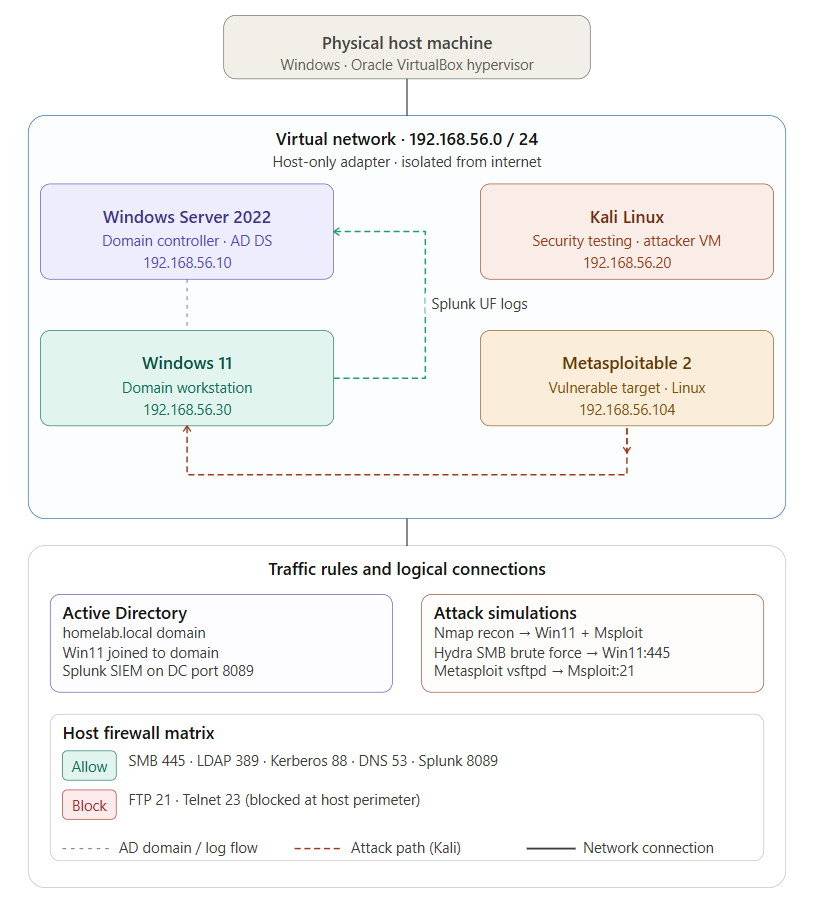

# Cybersecurity Home Lab

A hands-on virtualized lab environment built to simulate enterprise security operations, Active Directory administration, penetration testing, and incident response — end to end.

---

## Overview

This lab was built entirely on a Windows host using Oracle VirtualBox with no external infrastructure or cloud costs. It covers the full security lifecycle: from standing up an enterprise domain, hardening it, attacking it, detecting the attacks, responding to the incident, and remediating the vulnerabilities found.

---

## Lab Environment

| System | Role | IP Address |
|---|---|---|
| Windows Server 2022 | Domain Controller — AD DS, Splunk SIEM | 192.168.56.10 |
| Windows 11 | Domain Workstation — Splunk Forwarder | 192.168.56.30 |
| Kali Linux | Attacker VM — Nmap, Hydra, Metasploit | 192.168.56.20 |
| Metasploitable 2 | Vulnerable Target | 192.168.56.104 |

All VMs run on a host-only adapter (192.168.56.0/24), fully isolated from the internet.

---

## Network Topology



---

## Lab Phases

| Phase | Topic | Key Tools |
|---|---|---|
| [Phase 1](phase-1-environment-setup.md) | Environment Setup and Active Directory Deployment | VirtualBox, Windows Server 2022, AD DS |
| [Phase 2](phase-2-ad-hardening.md) | Active Directory Hardening | GPMC, Audit Policies, Account Lockout |
| [Phase 3](phase-3-network-segmentation.md) | Network Segmentation | VirtualBox Host-Only, Windows Firewall |
| [Phase 4](phase-4-attack-simulation.md) | Attack Simulation and Penetration Testing | Nmap, Hydra, Metasploit |
| [Phase 5](phase-5-splunk-deployment.md) | Splunk SIEM Deployment and Monitoring | Splunk Enterprise, Universal Forwarder, SPL |
| [Phase 6](phase-6-incident-response.md) | Incident Response | Splunk, VirtualBox Snapshots, Event Viewer |
| [Phase 7](phase-7-vulnerability-scanning.md) | Vulnerability Scanning and Remediation | Nessus Essentials |

---

## Skills Demonstrated

- Virtualization and lab design
- Windows Server and Active Directory administration
- Group Policy configuration and security hardening
- Network segmentation and firewall rule management
- Penetration testing — reconnaissance, exploitation, credential attacks
- SIEM deployment, log forwarding, and SPL querying
- Incident response — detection, containment, remediation, recovery
- Vulnerability assessment and remediation validation
- Security documentation

---

## Tools and Technologies

Oracle VirtualBox · Windows Server 2022 · Windows 11 · Kali Linux · Active Directory · Group Policy · Splunk Enterprise · Splunk Universal Forwarder · Nmap · Hydra · Metasploit Framework · Nessus Essentials · Windows Event Viewer

---

## Repository Structure

```
cybersecurity-home-lab/
├── README.md
├── phase-1-environment-setup.md
├── phase-2-ad-hardening.md
├── phase-3-network-segmentation.md
├── phase-4-attack-simulation.md
├── phase-5-splunk-deployment.md
├── phase-6-incident-response.md
├── phase-7-vulnerability-scanning.md
└── assets/
    └── network-diagram.png
```
