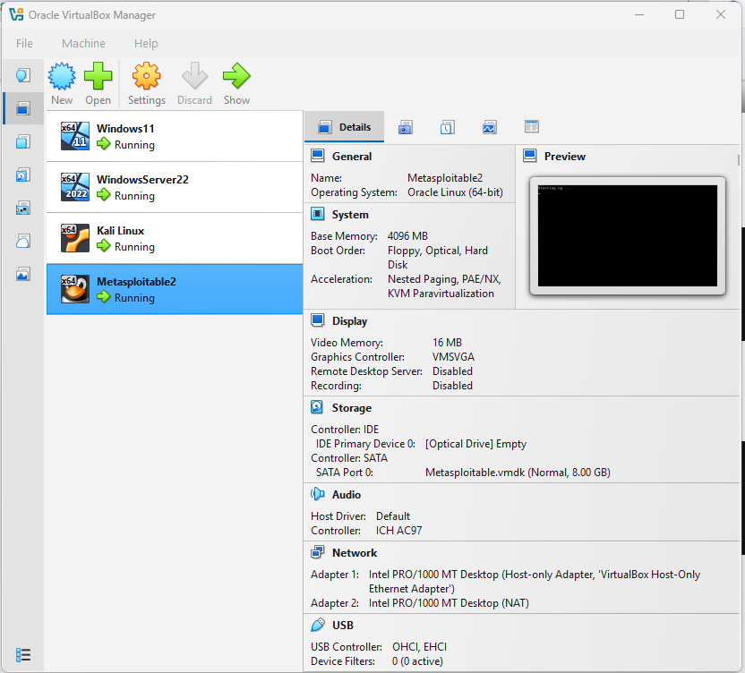

# Phase 1: Environment Setup and Active Directory Deployment

**Objective:** Design and deploy a virtualized enterprise lab environment capable of supporting cybersecurity testing, Active Directory administration, monitoring, and incident response simulations.

---

## Tools Used

- Oracle VirtualBox
- Windows Server 2022
- Windows 11
- Kali Linux
- Active Directory Domain Services (AD DS)

---

## Systems Configured

| System | Role | IP Address |
|---|---|---|
| Windows Server 2022 | Domain Controller | 192.168.56.10 |
| Windows 11 | Domain Workstation | 192.168.56.30 |
| Kali Linux | Security Testing Machine | 192.168.56.20 |
| Metasploitable 2 | Vulnerable Target | 192.168.56.104 |

---

## Steps Performed

1. Installed Oracle VirtualBox on the host system
2. Created virtual machines for Windows Server 2022, Windows 11, Kali Linux, and Metasploitable 2
3. Promoted Windows Server 2022 to a Domain Controller
4. Installed and configured Active Directory Domain Services
5. Created Organizational Units, security groups, and user accounts
6. Joined the Windows 11 machine to the domain
7. Verified domain authentication functionality

---

## Active Directory Configuration

### Groups Created

| Group Name |
|---|
| Family-Adults |
| Family-Kids |
| Finance |
| Marketing |

### User Accounts Created

| Display Name |
|---|
| Tumusiime Micah |
| Daniel Mbundi |
| Jeremia Atukunda |

---

## Skills Demonstrated

- Virtualization
- Windows Server Administration
- Active Directory Administration
- User and Group Management
- Domain Services Configuration
- Network Configuration

---

## Lessons Learned

This phase established the foundation of the cybersecurity lab and demonstrated how enterprise systems are centrally managed using Active Directory.

Future improvements include implementing DHCP, DNS monitoring, and centralized patch management.
