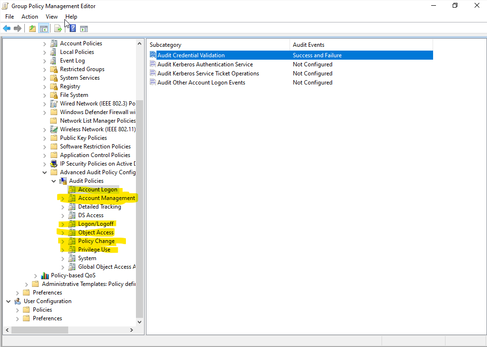

# Phase 2: Active Directory Hardening

**Objective:** Secure the Active Directory environment using enterprise-grade security policies and audit logging.

---

## Tools Used

- Group Policy Management Console (GPMC)
- Windows Server 2022
- Active Directory Users and Computers

---

## Steps Performed

1. Created a Group Policy Object named "Password Policy"
2. Configured password complexity requirements
3. Implemented account lockout protections
4. Enabled advanced audit logging policies
5. Disabled the built-in Administrator account
6. Applied Group Policies to domain systems
7. Verified policy application using `gpupdate`

---

## Security Policies Configured

### Password Policy

| Setting | Value |
|---|---|
| Minimum Password Length | 14 characters |
| Password Complexity | Enabled |
| Password History | 20 passwords |
| Maximum Password Age | 0 days |

### Account Lockout Policy

| Setting | Value |
|---|---|
| Lockout Threshold | 5 attempts |
| Lockout Duration | 15 minutes |
| Reset Counter | 10 minutes |

---

## Audit Policies Enabled

| Audit Policy |
|---|
| Audit Logon |
| Audit Credential Validation |
| Audit Account Lockout |
| Audit User Account Management |
| Audit Kerberos Authentication |
| Audit File System |
| Audit Policy Changes |
| Audit Sensitive Privilege Use |

---

## Skills Demonstrated

- Active Directory Hardening
- Group Policy Management
- Security Policy Configuration
- Windows Audit Logging
- Authentication Security

---

## Lessons Learned

This phase demonstrated the importance of enforcing centralized security policies in enterprise environments.

Strong password and lockout policies significantly reduce the risk of brute-force attacks. The 5-attempt lockout threshold directly counters tools like Hydra used in Phase 4.
