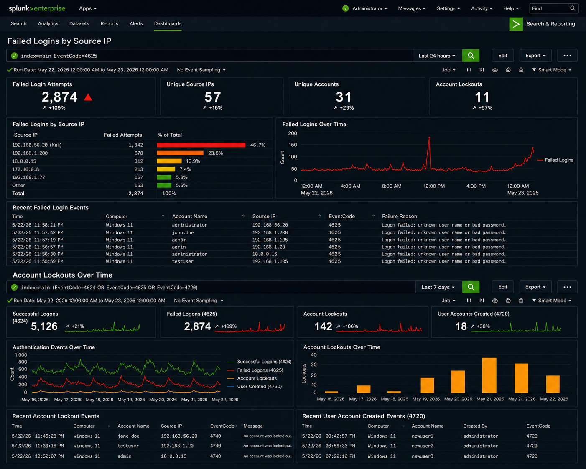

# Phase 5: Splunk SIEM Deployment and Monitoring

**Objective:** Deploy Splunk SIEM for centralized log collection, monitoring, and threat detection across the lab environment.

---

## Tools Used

- Splunk Enterprise Free Edition (Windows Server 2022)
- Splunk Universal Forwarder (Windows 11)
- Windows Event Viewer
- Kali Linux (log generation)

---

## Steps Performed

1. Installed Splunk Enterprise Free on Windows Server 2022
2. Installed Splunk Universal Forwarder on Windows 11
3. Configured forwarding of Windows Security logs from workstation to SIEM
4. Configured monitored Event IDs: 4624, 4625, and 4720
5. Generated failed login attempts from Kali Linux to produce log data
6. Queried events in Splunk using SPL
7. Built security dashboards for visual monitoring

---

## Log Forwarding Architecture

| Component | Host | Role |
|---|---|---|
| Splunk Enterprise | Windows Server 2022 — 192.168.56.10 | Central SIEM, receives and indexes logs |
| Splunk Universal Forwarder | Windows 11 — 192.168.56.30 | Forwards Windows Security logs to SIEM |
| Log source | Kali Linux — 192.168.56.20 | Attack simulation, generates event data |

---

## Event IDs Monitored

| Event ID | Description |
|---|---|
| 4624 | Successful logon |
| 4625 | Failed logon attempt |
| 4720 | New user account created |

---

## SPL Query Used

```spl
index=main EventCode=4625
```

---

## Findings

Splunk successfully detected and surfaced:

- Failed authentication attempts (Event ID 4625) from Kali Linux Hydra attack
- Source IP addresses of attacking machine
- Account lockout activity triggered by brute-force threshold
- Suspicious login patterns and timing anomalies

---

## Dashboards Created

| Dashboard | Purpose |
|---|---|
| Failed Logins by Source IP | Visualizes which IPs are generating authentication failures |
| Account Lockouts Over Time | Tracks lockout frequency and timing patterns |



---

## Skills Demonstrated

- SIEM Deployment and Configuration
- Log Forwarding and Indexing
- SPL (Search Processing Language)
- Threat Detection
- Security Dashboard Development
- Log Analysis

---

## Lessons Learned

This phase demonstrated the importance of centralized logging and security visibility in enterprise environments.

SIEM platforms significantly improve incident detection and investigation capabilities — the Hydra brute-force attack from Phase 4 produced clear, queryable evidence in Splunk within seconds of the attack running.
