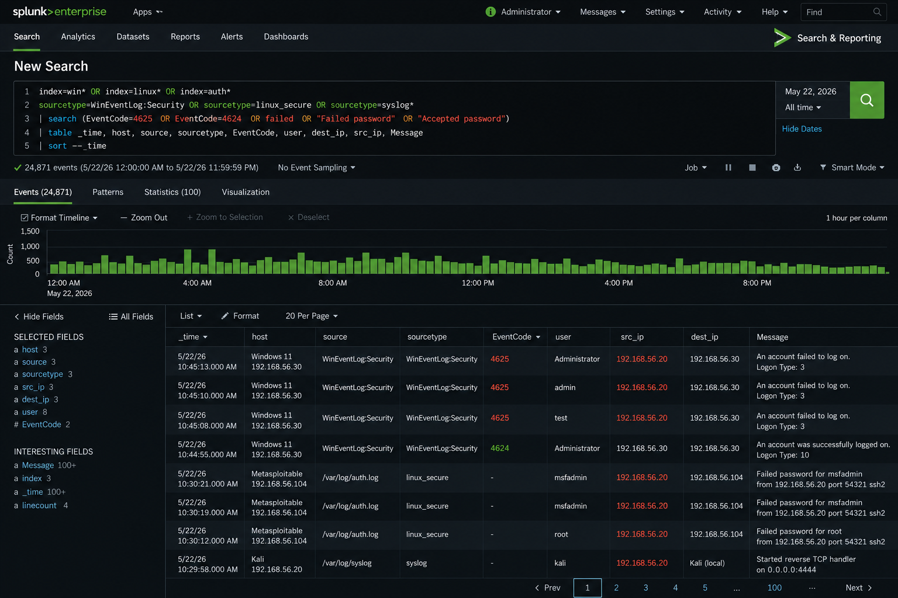

# Phase 6: Incident Response

**Objective:** Simulate a cybersecurity incident and perform formal incident response procedures including detection, containment, remediation, and recovery.

---

## Tools Used

- Splunk SIEM (Windows Server 2022)
- Metasploit Framework (Kali Linux)
- Oracle VirtualBox Snapshots
- Windows Event Viewer

---

## Steps Performed

1. Created VM snapshots before attack simulation (clean baseline)
2. Exploited Metasploitable 2 using Metasploit vsftpd backdoor
3. Performed unauthorized login attempts from Kali Linux via Hydra
4. Investigated generated logs in Splunk
5. Isolated the affected Kali Linux VM
6. Verified remediation steps and confirmed no domain compromise
7. Restored systems using VirtualBox snapshots
8. Documented the incident formally

---

## Incident Summary

Splunk SIEM detected multiple failed authentication attempts (Event ID 4625) originating from the Kali Linux VM (192.168.56.20) targeting the Windows 11 workstation (192.168.56.30) over SMB port 445.

Additional exploitation activity was identified against Metasploitable 2 (192.168.56.104) via the vsftpd 2.3.4 backdoor on port 21.

---

## Incident Response Lifecycle

### 1. Detection
- Splunk alert triggered on spike in Event ID 4625
- Source IP 192.168.56.20 identified as origin of brute-force activity

### 2. Containment

| Action | Detail |
|---|---|
| Isolated Kali Linux VM | Disabled network adapter to stop ongoing attack |
| Preserved logs | Exported Splunk search results for evidence |
| Verified domain integrity | Confirmed no successful domain account compromise |

### 3. Remediation

| Action | Detail |
|---|---|
| Verified password policies | Confirmed 14-character minimum and lockout threshold active |
| Confirmed account lockout protections | 5-attempt threshold functioning correctly |
| Reviewed firewall rules | Confirmed FTP (21) and Telnet (23) blocked at host |
| Updated Splunk monitoring | Added alert thresholds for faster future detection |

### 4. Recovery
- Restored clean VM states using VirtualBox snapshots
- Verified all systems returned to pre-incident baseline
- Re-enabled network adapters after confirming isolation was complete

---

## Skills Demonstrated

- Incident Response (Detection → Containment → Remediation → Recovery)
- Security Investigation and Log Analysis
- Threat Containment
- Evidence Preservation
- Recovery Procedures
- Security Documentation

---

## Lessons Learned

This phase demonstrated the importance of rapid incident detection, structured response procedures, and evidence-based investigation.

Pre-attack snapshots proved critical — they provided a clean recovery baseline and reduced restoration time to under five minutes. This mirrors enterprise DR (Disaster Recovery) practices where rollback capability is a core part of IR planning.
